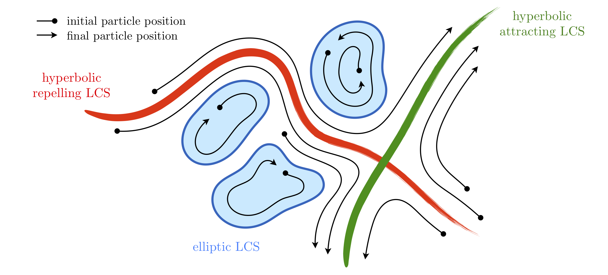

# CoherentStructures

This code accompanies the paper *Coherent structures in sparse and noisy data* by Mowlavi, Serra, Maiorino, and Mahadevan (2021).

We provide algorithms for the identification of Lagrangian Coherent Structures (LCSs) of hyperbolic and elliptic nature – see figure below – in flows characterized by sparse and noisy trajectory datasets, such as those obtained from experiments. Hyperbolic LCSs are surfaces along which the local separation rate between neighboring particles is maximized or minimized. Elliptic LCSs are surfaces enclosing regions of coherent global dynamics, that is, regions inside of
which particles move together over time.

The algorithms, which take as input trajectory data for an ensemble of particles, are located in the Python modules hyperbolic.py and elliptic.py in functions/. Their use is demonstrated through two of the examples shown in the paper, the Bickley jet and ABC flow.

## Main files

* **hyperbolic_Bickley** and **hyperbolic_ABC** compute hyperbolic LCSs in the Bickley jet and ABC flow, using the trajectory datasets hyperbolic_Bickley.mat and hyperbolic_ABC.mat

* **elliptic_Bickley** and **elliptic_ABC** compute elliptic LCSs in the Bickley jet and ABC flow, using the trajectory datasets elliptic_Bickley.mat and elliptic_ABC.mat

* **elliptic_Bickley_sweep** and **elliptic_ABC_sweep** evaluate the sensitivity of the computed elliptic LCSs with respect to the clustering parameters, helping select appropriate values for the latter

## Notes

1. The first time that an elliptic LCS is computed for a given dataset, a matrix of pairwise distances between all trajectories is computed and stored in a file named after the data file containing original dataset, appended with '_Dij'. This computation might take some time (about 30 min for the provided ABC example), but only needs to be carried out once.

2. The examples we provide contain different datasets for The algorithms for identifying hyperbolic and elliptic LCSs can be applied to the same trajectory dataset. However, hyperbolic LCSs require a higher spatial resolution (i.e. more trajectories) while elliptic LCSs require a higher temporal resolution (i.e. more time frames). Thus, the examples we provide contain different datasets for the two types of LCSs, which reproduce the results in figures 4, 5, 6, 7 of the paper for the case without noise.

## Dependencies

[pandas](https://pandas.pydata.org): A data manipulation library.
[scikit-learn](https://scikit-learn.org/): A machine learning library.
[Numba](https://numba.pydata.org): A JIT compiler for Python functions, used to accelerate the computation of the pairwise distance matrix.

[tqdm](https://pypi.org/project/tqdm/): A progress meter for loops.

[seaborn](https://pypi.org/project/tqdm/): A data visualization library.